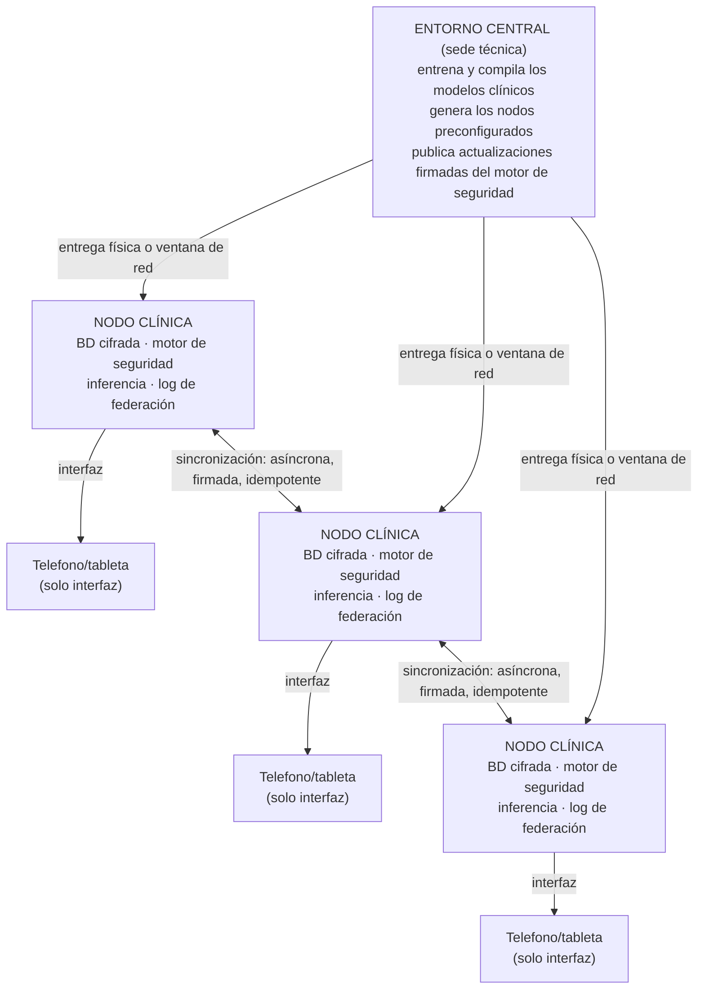
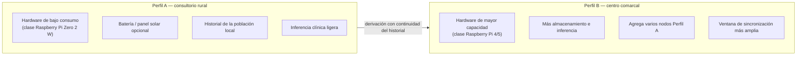
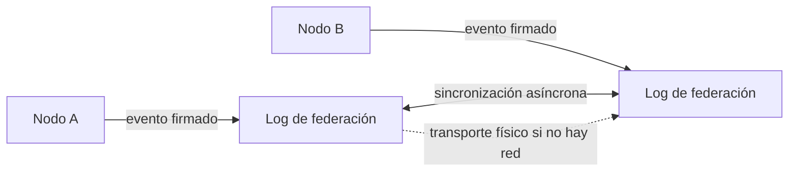
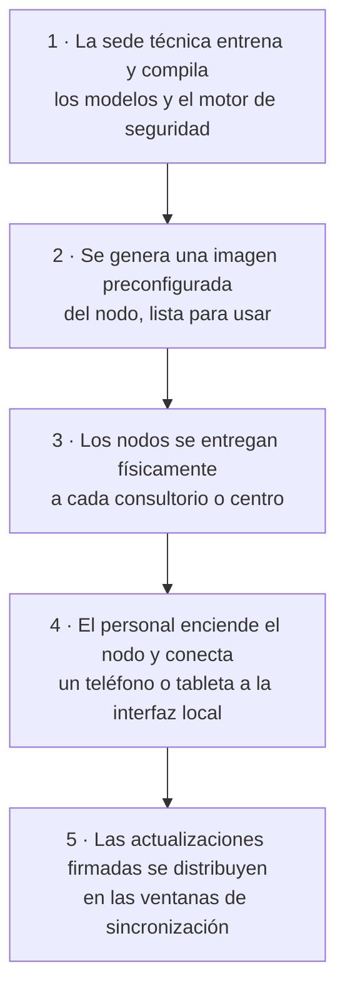

  <h1 align="center">Historia Clínica</h1>
  

    <strong>Memoria clínica nacional offline-first y red federada de seguridad del paciente para Guinea Ecuatorial</strong>
  

  
  
  
  

---

## El problema

En zonas con conectividad intermitente o nula, el historial de un paciente se fragmenta
entre consultorios que no se comunican entre sí. Una nueva prescripción puede entrar en
conflicto con un anticoagulante o una alergia registrada en otra sede, sin que el
profesional que atiende llegue a saberlo. Los sistemas que dependen de internet o de la
nube no funcionan donde la red no llega.

**Historia Clínica** lleva la memoria clínica y la seguridad del paciente al punto de atención,
funcionando **sin conexión** y conservando la continuidad del historial entre profesionales
y sedes.

## Qué es

Historia Clínica es una red sanitaria **offline-first** (funciona sin internet). Cada consultorio
recibe un **nodo preconfigurado** que contiene, ya instalado y listo para usar:

| Componente | Función |
|------------|---------|
| **Base de datos cifrada de pacientes** | Historial clínico local, cifrado en reposo, accesible solo desde el nodo. |
| **Motor de seguridad farmacológica** | Detección determinista de interacciones, reactividad cruzada de alergias y contraindicaciones, sin servicios externos. |
| **Inferencia clínica local** | Síntesis y razonamiento clínico ejecutados en el propio nodo; los datos del paciente no salen del consultorio. |
| **Registro de eventos de federación** | Bitácora a prueba de manipulaciones que sostiene la sincronización entre nodos. |
| **Interfaz de revisión** | Web/app servida localmente por el nodo a teléfonos y tabletas de la sala. |

Los teléfonos y tabletas actúan **únicamente como interfaz**. Nunca almacenan la base de
datos maestra: el nodo es la fuente de verdad local.

La red **coexiste** con los sistemas nacionales existentes (SNIS, DHIS2). No los reemplaza:
los complementa aportando seguridad del paciente en el punto de atención.

## Arquitectura

El único componente que requiere coordinación entre sedes es la **red de federación**, y
ésta funciona de forma **asíncrona**: los nodos sincronizan eventos cuando hay una ventana
de conectividad (horas, días, o mediante transporte físico de datos). Entre
sincronizaciones, cada nodo es plenamente funcional por sí solo.

## Perfiles de dispositivo

Ambos perfiles ejecutan el **mismo software**. La diferencia es de capacidad, no de
funcionalidad. Un paciente atendido en un consultorio rural y derivado a un centro comarcal
conserva la continuidad de su historial a través de la federación.

## Red de federación

- **Asíncrona:** los nodos no necesitan estar conectados simultáneamente.
- **Firmada:** cada evento lleva una firma que verifica su origen e integridad.
- **Idempotente:** reaplicar un evento ya recibido no altera el estado — la sincronización es
  segura aunque se repita o llegue en desorden.
- **Resistente al transporte físico:** sin red, los eventos pueden trasladarse en un soporte
  físico entre sedes sin pérdida de garantías.

## Privacidad y soberanía de los datos

- Los datos del paciente **no salen del consultorio** durante la atención.
- **No hay nube** que concentre los historiales nacionales.
- La sede central solo distribuye software (modelos y motor de seguridad); nunca recibe datos
  de pacientes para operar.
- El cifrado en reposo y las firmas de federación protegen frente a pérdida o manipulación del
  hardware.

## Coexistencia con SNIS / DHIS2

Historia Clínica **no reemplaza** el sistema nacional de información sanitaria. Se sitúa en el
punto de atención y aporta:

- seguridad del paciente en tiempo real (alertas de fármacos, alergias, contradicciones),
- continuidad del historial entre profesionales,
- funcionamiento garantizado sin conexión.

Los indicadores agregados que requieran SNIS/DHIS2 pueden derivarse de los nodos mediante
exportaciones controladas, respetando los flujos de reporte ya establecidos en el país.

## Modelo de despliegue

Sin instalación compleja en sede. Sin dependencia de internet para operar.

## Documentación

| Documento | Contenido |
|-----------|-----------|
| [Arquitectura nacional](docs/ARQUITECTURA_EG.md) | Diseño completo: nodos, perfiles, federación, soberanía de datos, coexistencia SNIS/DHIS2. |
| [Whitepaper (Español)](docs/WHITEPAPER_EG_ES.md) | Documento de revisión para evaluación nacional. |
| [Whitepaper (English)](docs/WHITEPAPER_EG_EN.md) | Review document, English copy. |
| [Demostración](docs/demo.html) | Panel de demostración interactivo (revisión privada). |

## Licencia

Apache-2.0 — consulte [LICENSE](LICENSE) y [NOTICE](NOTICE)

Desarrollado por [STARGA Inc.](https://star.ga)
