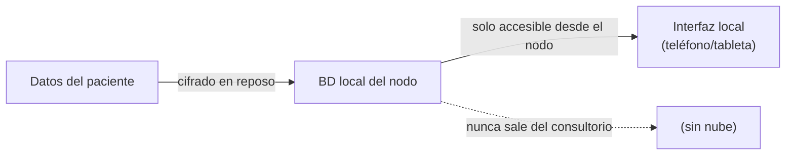

# Política de seguridad

## Soberanía y privacidad de los datos

Historia Clínica está diseñado para que los datos del paciente **no salgan del consultorio**
durante la atención. No existe un servicio en la nube que concentre los historiales
nacionales. La sede técnica central solo distribuye software (modelos e motor de seguridad);
nunca recibe datos de pacientes para operar.

## Comunicación de vulnerabilidades

Si descubre una vulnerabilidad de seguridad, le rogamos que la comunique de forma
responsable:

- **Correo electrónico:** noreply@star.ga
- **No** abra una incidencia pública en GitHub para vulnerabilidades de seguridad.

## Medidas de seguridad

### Cifrado y almacenamiento local

- La base de datos del paciente está **cifrada en reposo** y solo es accesible desde el nodo.
- Los teléfonos y tabletas actúan únicamente como interfaz; nunca almacenan la base de datos
  maestra.

### Federación firmada

- Cada evento de federación lleva una **firma** que permite verificar su origen e integridad.
- La sincronización es **idempotente**: reaplicar un evento ya recibido no altera el estado.
- El registro de eventos es **a prueba de manipulaciones**, lo que permite auditar la cadena
  de cambios clínicos.

### Resistencia del hardware

- El cifrado en reposo protege frente a la pérdida o el robo del nodo.
- Las firmas de federación protegen frente a la manipulación de los eventos en tránsito o
  durante el transporte físico de datos.

### Funcionamiento sin conexión

- El nodo es plenamente funcional sin conexión a internet; no depende de servicios externos
  para la atención.
- No se realizan llamadas a APIs externas con datos del paciente durante el funcionamiento
  normal.
