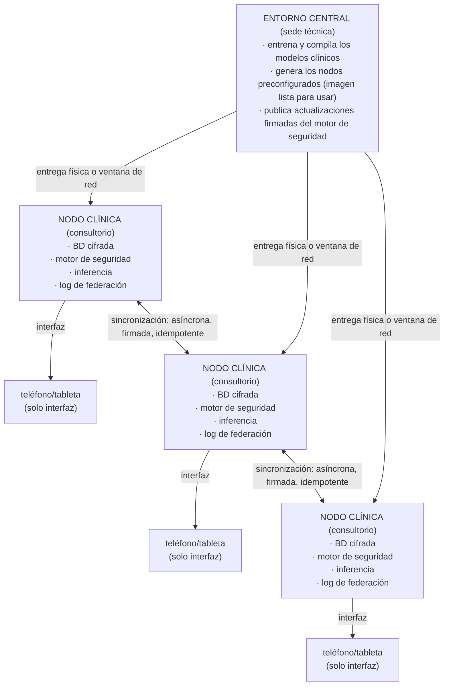

# Historia Clínica — Arquitectura Nacional para Guinea Ecuatorial

> **Memoria clínica offline y red federada de seguridad del paciente**
> Documento de arquitectura · revisión privada · no distribuir

---

## 1. Resumen

Historia Clínica es una red sanitaria **offline-first** (funciona sin conexión a internet)
diseñada para entornos con conectividad intermitente o nula. Cada consultorio médico
recibe un **nodo preconfigurado** que contiene, ya instalado y listo para usar:

- la base de datos cifrada de pacientes,
- el motor de seguridad farmacológica (interacciones, alergias, contraindicaciones),
- la inferencia clínica local (sin llamadas a servicios externos),
- el registro de eventos de federación a prueba de manipulaciones.

Los teléfonos y tabletas actúan **únicamente como interfaz**. Nunca almacenan la base de
datos maestra. El nodo es la fuente de verdad local.

La red **coexiste** con los sistemas nacionales existentes (SNIS, DHIS2). No los
reemplaza: los complementa aportando seguridad del paciente en el punto de atención y
continuidad del historial entre profesionales.

---

## 2. Principio de diseño: eliminar la dependencia de internet

El único componente que requiere coordinación entre sedes es la **red de federación**,
y ésta funciona de forma asíncrona: los nodos sincronizan eventos cuando hay una ventana
de conectividad disponible (puede ser por horas, días o mediante transporte físico de
datos). Entre sincronizaciones, cada nodo es plenamente funcional por sí solo.

---

## 3. Perfiles de dispositivo

### Perfil A — Consultorio individual / centro rural

- Hardware de bajo consumo (clase Raspberry Pi Zero 2 W o equivalente).
- Alimentación por batería o panel solar opcional.
- Capacidad para el historial de la población local del consultorio.
- Inferencia clínica ligera preinstalada.
- Pensado para sedes sin electricidad estable ni red.

### Perfil B — Centro de salud / hospital comarcal

- Hardware de mayor capacidad (clase Raspberry Pi 4/5 o servidor pequeño).
- Mayor capacidad de almacenamiento e inferencia.
- Actúa como punto de agregación para varios nodos de Perfil A de su zona.
- Puede mantener una ventana de sincronización más amplia con la sede central.

Ambos perfiles ejecutan el **mismo software**. La diferencia es únicamente de capacidad,
no de funcionalidad. Un paciente atendido en un consultorio rural y luego derivado a un
centro comarcal conserva la continuidad de su historial a través de la federación.

---

## 4. Componentes del nodo

| Componente | Función |
|------------|---------|
| **Base de datos cifrada de pacientes** | Historial clínico local, cifrado en reposo. Solo accesible desde el nodo. |
| **Motor de seguridad farmacológica** | Detección determinista de interacciones medicamentosas, reactividad cruzada de alergias y contraindicaciones, sin depender de servicios externos. |
| **Inferencia clínica local** | Síntesis y razonamiento clínico ejecutados en el propio nodo. Sin envío de datos del paciente fuera del consultorio. |
| **Registro de eventos de federación** | Bitácora a prueba de manipulaciones de los cambios clínicos, base de la sincronización entre nodos. |
| **Interfaz de revisión** | Interfaz web/app servida localmente por el nodo a teléfonos y tabletas de la sala. |

---

## 5. Red de federación

- **Asíncrona:** los nodos no necesitan estar conectados simultáneamente.
- **Firmada:** cada evento lleva una firma que permite verificar su origen e integridad.
- **Idempotente:** reaplicar un evento ya recibido no altera el estado — la sincronización
  es segura aunque se repita o llegue en desorden.
- **Resistente al transporte físico:** si no hay red, los eventos pueden trasladarse en un
  soporte físico entre sedes sin pérdida de garantías.

El objetivo es la **continuidad del historial del paciente entre profesionales y sedes**,
incluso cuando no hay ninguna infraestructura de red disponible.

---

## 6. Privacidad y soberanía de los datos

- Los datos del paciente **no salen del consultorio** durante la atención.
- No hay servicio en la nube que concentre los historiales nacionales.
- La sede central solo distribuye software (modelos y motor de seguridad), nunca recibe
  datos de pacientes para su funcionamiento.
- El cifrado en reposo y las firmas de federación protegen frente a pérdida o manipulación
  del hardware.

---

## 7. Coexistencia con SNIS / DHIS2

Historia Clínica **no reemplaza** el sistema nacional de información sanitaria. Se sitúa en
el punto de atención, donde aporta:

- seguridad del paciente en tiempo real (alertas de fármacos, alergias, contradicciones),
- continuidad del historial entre profesionales,
- funcionamiento garantizado sin conexión.

Los indicadores agregados que requieran SNIS/DHIS2 pueden derivarse de los nodos mediante
exportaciones controladas, respetando los flujos de reporte ya establecidos en el país.

---

## 8. Modelo de despliegue

1. La sede técnica central **entrena y compila** los modelos clínicos y el motor de
   seguridad.
2. Se genera una **imagen preconfigurada** del nodo, lista para usar.
3. Los nodos se **entregan físicamente** a cada consultorio o centro, ya preparados.
4. El personal sanitario solo necesita encender el nodo y conectar un teléfono o tableta a
   la interfaz local.
5. Las **actualizaciones firmadas** del motor de seguridad se distribuyen en las ventanas de
   sincronización disponibles.

Sin instalación compleja en sede. Sin dependencia de internet para operar.
