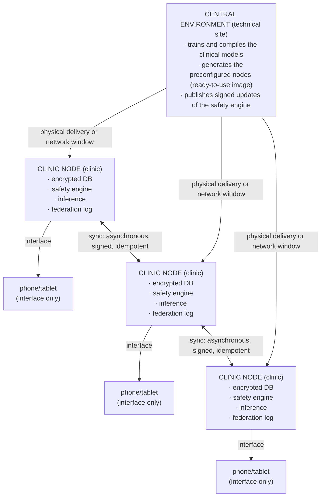

# Historia Clínica — National Clinical Memory

## Offline Clinical Memory and Federated Patient-Safety Network for Equatorial Guinea

**Technical whitepaper**
STARGA, Inc. · Private review · Not for distribution

---

## Executive summary

**Historia Clínica** is a national **offline-first** health network: built to operate fully
without an internet connection. Its purpose is to give every point of care in Equatorial
Guinea —from the rural clinic without stable electricity to the district hospital— three
capabilities that today are missing or fragmented:

1. **Patient safety at the point of care.** Automatic detection of drug interactions,
   allergies, and contraindications at the moment of prescribing, with no network required.
2. **Continuity of the clinical record across providers and sites.** A patient's history
   follows them even when they are seen by different clinicians at different facilities.
3. **National sovereignty over health data.** Patient data never leaves the clinic and is
   never concentrated in any foreign cloud service.

The system **coexists** with existing national health infrastructure (SNIS, DHIS2); it does
not replace it. It is delivered as **preconfigured physical nodes** —one small device per
clinic, ready to use— that health staff need only switch on.

---

## 1. The problem

Safe clinical practice depends on information that is often unavailable where and when it is
needed:

- **Intermittent or absent connectivity.** Much of the territory lacks reliable internet.
  Any system that depends on the cloud fails precisely in the places of greatest need.
- **Fragmented records.** When a patient changes provider or facility, their history does
  not travel with them. Allergies, ongoing treatments, and prior history are lost or
  reconstructed from memory.
- **Preventable medication errors.** Drug interactions and allergy contraindications are a
  frequent and avoidable cause of patient harm. Catching them requires up-to-date knowledge
  available at the moment of prescribing.
- **Dependence on, and cost of, external infrastructure.** Cloud-based solutions move
  national health data out of the country and create dependencies on connectivity and
  outside vendors.

---

## 2. Design principle: eliminate the dependence on internet

Historia Clínica inverts the usual model. Instead of a central cloud service that every
point of care must connect to, **each clinic is autonomous**. The only component that
coordinates across sites is the **federation network**, and it works **asynchronously**:
nodes synchronize events whenever a connectivity window is available —over hours, over days,
or even by physically transporting the data. Between synchronizations, each node is fully
functional on its own.

Phones and tablets act **only as an interface**. They never store the master database. The
node is the local source of truth.

---

## 3. Node architecture

Each node contains, already installed and ready to use:

| Component | Function |
|-----------|----------|
| **Encrypted patient database** | Local clinical history, encrypted at rest. Accessible only from the node. |
| **Drug-safety engine** | Deterministic detection of drug interactions, allergy cross-reactivity, and contraindications, without depending on external services. |
| **Local clinical inference** | Clinical synthesis and reasoning executed on the node itself. No patient data sent outside the clinic. |
| **Federation event log** | Tamper-evident record of clinical changes, the basis for synchronization between nodes. |
| **Review interface** | Web/app interface served locally by the node to phones and tablets in the room. |

---

## 4. Device strategy

### Profile A — Individual clinic / rural center

- Low-power hardware (Raspberry Pi Zero 2 W class or equivalent).
- Battery or optional solar-panel power.
- Capacity for the clinic's local population history.
- Lightweight clinical inference preinstalled.
- Designed for sites without stable electricity or network.

### Profile B — Health center / district hospital

- Higher-capacity hardware (Raspberry Pi 4/5 class or small server).
- Greater storage and inference capacity.
- Acts as an aggregation point for several Profile A nodes in its area.
- Can maintain a wider synchronization window with the central site.

Both profiles run the **same software**. The difference is only one of capacity, not of
functionality. A patient seen at a rural clinic and later referred to a district center
retains continuity of their history through the federation.

---

## 5. The federation network

The federation is the only component that coordinates across sites, and it is designed to
work under the worst connectivity conditions:

- **Asynchronous:** nodes do not need to be connected at the same time.
- **Signed:** each event carries a signature that allows its origin and integrity to be
  verified.
- **Idempotent:** reapplying an already-received event does not alter state — synchronization
  is safe even if it repeats or arrives out of order.
- **Resilient to physical transport:** if there is no network, events can be moved on a
  physical medium between sites without loss of guarantees.

The goal is **continuity of the patient's record across providers and sites**, even when no
network infrastructure is available at all.

---

## 6. Privacy and data sovereignty

- Patient data **does not leave the clinic** during care.
- There is no cloud service concentrating national records.
- The central site only distributes software (models and the safety engine); it never
  receives patient data in order to function.
- Encryption at rest and federation signatures protect against loss or tampering of the
  hardware.

The design guarantees that the national health record remains under the country's control,
without moving to third-party infrastructure.

---

## 7. Coexistence with national health infrastructure (SNIS / DHIS2)

Historia Clínica **does not replace** the national health information system. It sits at the
point of care, where it provides what those systems do not cover:

- real-time patient safety (drug, allergy, and contraindication alerts),
- continuity of the record across providers,
- guaranteed operation without a connection.

Aggregate indicators required by SNIS/DHIS2 can be derived from the nodes through controlled
exports, respecting the reporting flows already established in the country.

---

## 8. Deployment model

1. The central technical site **trains and compiles** the clinical models and the safety
   engine.
2. A **preconfigured node image** is generated, ready to use.
3. Nodes are **physically delivered** to each clinic or center, already prepared.
4. Health staff need only switch on the node and connect a phone or tablet to the local
   interface.
5. **Signed updates** of the safety engine are distributed during available synchronization
   windows.

No complex on-site installation. No internet dependence to operate.

---

## 9. Phased deployment (proposal)

- **Phase 1 — Pilot.** Deploy nodes in a small set of clinics plus one district aggregation
  center. Validate drug safety, record continuity, and asynchronous synchronization under
  real conditions.
- **Phase 2 — Regional expansion.** Expand to a complete health region, with several Profile
  A nodes federated through Profile B nodes.
- **Phase 3 — National coverage.** Progressive extension to the rest of the country, keeping
  coexistence with SNIS/DHIS2 and national reporting flows.

Each phase is independent: nodes deployed in Phase 1 keep working even if expansion stops,
because no node depends on the others to operate.

---

## 10. Benefits for Equatorial Guinea

- **Works where there is no internet** — precisely where it is most needed.
- **Reduces preventable medication errors** through point-of-care alerts.
- **Provides continuity of the patient record** across providers and sites.
- **Keeps health-data sovereignty** within the country.
- **Coexists with national systems** without requiring their replacement.
- **Simple, robust deployment:** preconfigured nodes, with no complex installation and no
  connectivity dependence to operate.

---

*Historia Clínica — STARGA, Inc. Private review document. Not for distribution.*
