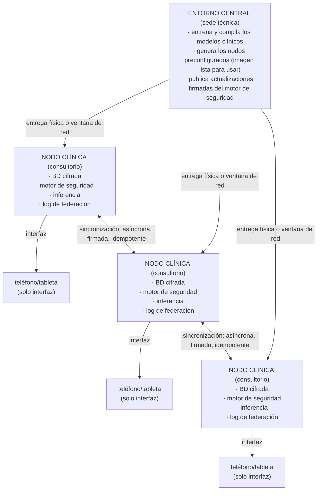

# Historia Clínica — Memoria Clínica Nacional

## Memoria clínica offline y red federada de seguridad del paciente para Guinea Ecuatorial

**Documento técnico (whitepaper)**
STARGA, Inc. · Revisión privada · No distribuir

---

## Resumen ejecutivo

**Historia Clínica** es una red sanitaria nacional **offline-first**: diseñada para
funcionar de forma completa sin conexión a internet. Su objetivo es dotar a cada punto de
atención de Guinea Ecuatorial —desde el consultorio rural sin electricidad estable hasta
el hospital comarcal— de tres capacidades que hoy faltan o están fragmentadas:

1. **Seguridad del paciente en el punto de atención.** Detección automática de
   interacciones medicamentosas, alergias y contraindicaciones en el momento de prescribir,
   sin necesidad de red.
2. **Continuidad del historial clínico entre profesionales y sedes.** El historial de un
   paciente lo acompaña aunque sea atendido por distintos médicos en distintos centros.
3. **Soberanía nacional de los datos sanitarios.** Los datos del paciente no salen del
   consultorio y no se concentran en ningún servicio en la nube extranjero.

El sistema **coexiste** con la infraestructura sanitaria nacional existente (SNIS, DHIS2);
no la reemplaza. Se entrega como **nodos físicos preconfigurados** —un pequeño equipo por
consultorio, ya listo para usar— que el personal sanitario solo necesita encender.

---

## 1. El problema

La práctica clínica segura depende de información que muchas veces no está disponible donde
y cuando se necesita:

- **Conectividad intermitente o nula.** Gran parte del territorio carece de internet fiable.
  Cualquier sistema que dependa de la nube falla precisamente en los lugares de mayor
  necesidad.
- **Historial fragmentado.** Cuando un paciente cambia de profesional o de centro, su
  historial no viaja con él. Las alergias, los tratamientos en curso y los antecedentes se
  pierden o se reconstruyen de memoria.
- **Errores de medicación prevenibles.** Las interacciones farmacológicas y las
  contraindicaciones por alergia son una causa frecuente y evitable de daño al paciente.
  Detectarlas requiere conocimiento actualizado disponible en el momento de prescribir.
- **Dependencia y coste de infraestructura externa.** Las soluciones basadas en la nube
  trasladan los datos sanitarios nacionales fuera del país y crean dependencias de
  conectividad y de proveedores externos.

---

## 2. El principio de diseño: eliminar la dependencia de internet

Historia Clínica invierte el modelo habitual. En lugar de un servicio central en la nube al
que todos los puntos de atención deben conectarse, **cada consultorio es autónomo**. El
único componente que coordina entre sedes es la **red de federación**, y ésta funciona de
forma **asíncrona**: los nodos sincronizan eventos cuando hay una ventana de conectividad
disponible —por horas, por días, o incluso mediante transporte físico de datos. Entre
sincronizaciones, cada nodo es plenamente funcional por sí solo.

Los teléfonos y tabletas actúan **únicamente como interfaz**. Nunca almacenan la base de
datos maestra. El nodo es la fuente de verdad local.

---

## 3. Arquitectura del nodo

Cada nodo contiene, ya instalado y listo para usar:

| Componente | Función |
|------------|---------|
| **Base de datos cifrada de pacientes** | Historial clínico local, cifrado en reposo. Solo accesible desde el nodo. |
| **Motor de seguridad farmacológica** | Detección determinista de interacciones medicamentosas, reactividad cruzada de alergias y contraindicaciones, sin depender de servicios externos. |
| **Inferencia clínica local** | Síntesis y razonamiento clínico ejecutados en el propio nodo. Sin envío de datos del paciente fuera del consultorio. |
| **Registro de eventos de federación** | Bitácora a prueba de manipulaciones de los cambios clínicos, base de la sincronización entre nodos. |
| **Interfaz de revisión** | Interfaz web/app servida localmente por el nodo a teléfonos y tabletas de la sala. |

---

## 4. Estrategia de dispositivos

### Perfil A — Consultorio individual / centro rural

- Hardware de bajo consumo (clase Raspberry Pi Zero 2 W o equivalente).
- Alimentación por batería o panel solar opcional.
- Capacidad para el historial de la población local del consultorio.
- Inferencia clínica ligera preinstalada.
- Pensado para sedes sin electricidad estable ni red.

### Perfil B — Centro de salud / hospital comarcal

- Hardware de mayor capacidad (clase Raspberry Pi 4/5 o servidor pequeño).
- Mayor capacidad de almacenamiento e inferencia.
- Actúa como punto de agregación para varios nodos de Perfil A de su zona.
- Puede mantener una ventana de sincronización más amplia con la sede central.

Ambos perfiles ejecutan el **mismo software**. La diferencia es únicamente de capacidad, no
de funcionalidad. Un paciente atendido en un consultorio rural y luego derivado a un centro
comarcal conserva la continuidad de su historial a través de la federación.

---

## 5. La red de federación

La federación es el único componente que coordina entre sedes, y está diseñada para
funcionar en las peores condiciones de conectividad:

- **Asíncrona:** los nodos no necesitan estar conectados simultáneamente.
- **Firmada:** cada evento lleva una firma que permite verificar su origen e integridad.
- **Idempotente:** reaplicar un evento ya recibido no altera el estado — la sincronización
  es segura aunque se repita o llegue en desorden.
- **Resistente al transporte físico:** si no hay red, los eventos pueden trasladarse en un
  soporte físico entre sedes sin pérdida de garantías.

El objetivo es la **continuidad del historial del paciente entre profesionales y sedes**,
incluso cuando no hay ninguna infraestructura de red disponible.

---

## 6. Privacidad y soberanía de los datos

- Los datos del paciente **no salen del consultorio** durante la atención.
- No hay servicio en la nube que concentre los historiales nacionales.
- La sede central solo distribuye software (modelos y motor de seguridad); nunca recibe
  datos de pacientes para su funcionamiento.
- El cifrado en reposo y las firmas de federación protegen frente a pérdida o manipulación
  del hardware.

El diseño garantiza que el historial sanitario nacional permanezca bajo control del país,
sin trasladarse a infraestructuras de terceros.

---

## 7. Coexistencia con la infraestructura sanitaria nacional (SNIS / DHIS2)

Historia Clínica **no reemplaza** el sistema nacional de información sanitaria. Se sitúa en
el punto de atención, donde aporta lo que esos sistemas no cubren:

- seguridad del paciente en tiempo real (alertas de fármacos, alergias, contraindicaciones),
- continuidad del historial entre profesionales,
- funcionamiento garantizado sin conexión.

Los indicadores agregados que requieran SNIS/DHIS2 pueden derivarse de los nodos mediante
exportaciones controladas, respetando los flujos de reporte ya establecidos en el país.

---

## 8. Modelo de despliegue

1. La sede técnica central **entrena y compila** los modelos clínicos y el motor de
   seguridad.
2. Se genera una **imagen preconfigurada** del nodo, lista para usar.
3. Los nodos se **entregan físicamente** a cada consultorio o centro, ya preparados.
4. El personal sanitario solo necesita encender el nodo y conectar un teléfono o tableta a
   la interfaz local.
5. Las **actualizaciones firmadas** del motor de seguridad se distribuyen en las ventanas de
   sincronización disponibles.

Sin instalación compleja en sede. Sin dependencia de internet para operar.

---

## 9. Despliegue por fases (propuesta)

- **Fase 1 — Piloto.** Despliegue de nodos en un conjunto reducido de consultorios y un
  centro comarcal de agregación. Validación de la seguridad farmacológica, la continuidad
  del historial y la sincronización asíncrona en condiciones reales.
- **Fase 2 — Expansión regional.** Ampliación a una región sanitaria completa, con varios
  nodos de Perfil A federados a través de nodos de Perfil B.
- **Fase 3 — Cobertura nacional.** Extensión progresiva al resto del país, manteniendo la
  coexistencia con SNIS/DHIS2 y los flujos de reporte nacionales.

Cada fase es independiente: los nodos desplegados en la Fase 1 siguen funcionando aunque la
expansión se detenga, porque ningún nodo depende de los demás para operar.

---

## 10. Beneficios para Guinea Ecuatorial

- **Funciona donde no hay internet** — precisamente donde más se necesita.
- **Reduce errores de medicación prevenibles** mediante alertas en el punto de atención.
- **Da continuidad al historial del paciente** entre profesionales y sedes.
- **Mantiene la soberanía de los datos sanitarios** dentro del país.
- **Coexiste con los sistemas nacionales** sin exigir su sustitución.
- **Despliegue sencillo y robusto:** nodos preconfigurados, sin instalación compleja ni
  dependencia de conectividad para operar.

---

*Historia Clínica — STARGA, Inc. Documento de revisión privada. No distribuir.*
