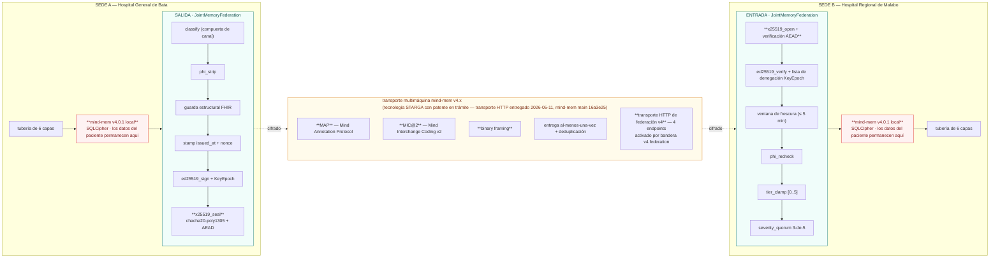
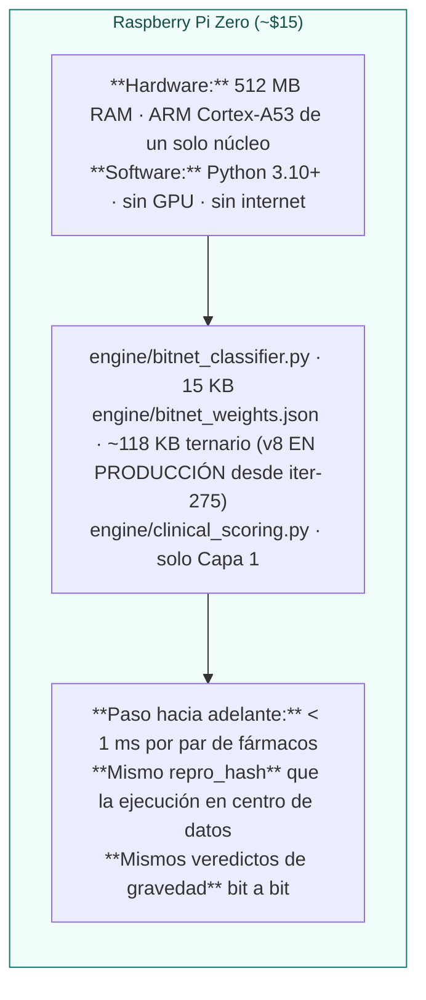

# Historia Clínica — Arquitectura de Despliegue

> *"Cada capa es auditable de forma independiente. La pila completa es
>  reproducible bit a bit en una Raspberry Pi o en un clúster empresarial de GPU."*

Este documento es la referencia canónica de arquitectura de despliegue de
Historia Clínica. Complementa los documentos por componente
(`docs/bitnet_training.md`, `docs/federated_memory.md`,
`docs/clinical_validation.md`) mostrando cómo
encajan las piezas en tiempo de ejecución y entre sedes.

## Despliegue en sede única (un hospital)

```mermaid
flowchart TB
    EHR["**HCE / SMART-on-FHIR**<br/>Epic · Cerner · MEDITECH"]
    AGENT(["Agente de IA Sanitaria"])

    EHR -->|"FHIR R4 Bundle<br/>(Patient + Conditions + MedicationStatement<br/>+ Practitioners con identificador de profesional + AllergyIntolerance)"| FHIR

    subgraph INGEST["engine.fhir_adapter.ingest_bundle()"]
      FHIR["Validación FHIR R4<br/>· Depuración de datos del paciente (18 ids)<br/>· Validación Luhn del identificador de profesional<br/>· ancla canónica SHA-256"]
    end

    FHIR -->|"ClinicalIngestResult<br/>(meds, conditions, allergies,<br/>observations, practitioner_npis)"| L1

    subgraph PIPELINE["TUBERÍA DE SEGURIDAD DE 6 CAPAS"]
      direction TB
      L1["L1 · Tabla determinista<br/>&lt; 1 ms · SIN CONEXIÓN"]
      L2["L2 · API OpenEvidence<br/>~2 s · EN LÍNEA"]
      L3["L3 · NIH RxNorm DDI<br/>~1 s · EN LÍNEA"]
      L4["L4 · Consenso de 6 LLM<br/>~3 s · EN LÍNEA"]
      L45["**L4.5 · BitNet b1.58 (Q16.16)**<br/>&lt; 1 ms · SIN CONEXIÓN<br/>primitiva de reproducibilidad para validación clínica<br/>**100% sensibilidad en contraindicados (NTI)**"]
      L5["L5 · Síntesis LLM (con citas)<br/>~3 s · EN LÍNEA"]
      L6["L6 · Compuerta de abstención<br/>0 ms · SIN CONEXIÓN"]
      L1 --> L2 --> L3 --> L4 --> L45 --> L5 --> L6
    end

    L6 -->|"list[DrugInteraction] +<br/>bitnet_severity + repro_hash + weights_id"| MEM

    subgraph MEM["mind-mem v4.0.1 (almacén local)"]
      MEM_INNER["SQLCipher en reposo (protección de datos del paciente)<br/>· Recuperación BM25 + vector + RRF<br/>· Cadena de auditoría TAG_v1 separada por NUL (Q16.16)<br/>· Extracción de memoria local Qwen-3.5-4B<br/>· Decaimiento por niveles + detección de contradicciones<br/>· kernel cognitivo v4 + observabilidad (opcional)"]
    end

    MEM --> AUDIT
    subgraph AUDIT["engine.audit_export_part11"]
      AUDIT_INNER["Cadena de hash Merkle JSON-LD<br/>· Firma Ed25519 atestiguada por identificador de profesional<br/>· Reproducible por auditoría décadas después"]
    end

    AUDIT --> MCP & A2A
    MCP["**Servidor MCP** (18 herramientas)<br/>Streamable HTTP · Azure"]
    A2A["**Agente A2A** (5 habilidades · 13 herramientas)<br/>Google ADK · Azure"]
    MCP --> AGENT
    A2A --> AGENT

    classDef offline fill:#F0FDFA,stroke:#0F766E,color:#134E4A
    classDef online fill:#EFF6FF,stroke:#2563eb,color:#1e3a8a
    classDef critical fill:#FEF3C7,stroke:#d97706,color:#7c2d12,font-weight:bold
    class L1,L45,L6 offline
    class L2,L3,L4,L5 online
    class L45 critical
```

## Federación multisede (entre hospitales)

**Separación semántica de dos canales:**

| Canal | Qué circula | A dónde va |
|---|---|---|
| **Canal de conocimiento** (cifrado, firmado) | Veredictos de gravedad de pares de fármacos + `repro_hash` + `bundle_id`, activaciones BitNet en pares novedosos, testigos de la cadena de auditoría (recibos de hash), patrones anonimizados de desacuerdo entre profesionales | A través de la federación, entre sedes, libre de propagarse |
| **Canal de datos del paciente** (permanece local) | Nombres de pacientes, fecha de nacimiento, número de historia, direcciones, identificadores de seguro, recursos FHIR Patient, notas clínicas de texto libre | NUNCA sale de la sede de origen — puesto en cuarentena por invariante tipado en tiempo de ejecución, no por política |

## Despliegue en el borde / sin conexión (Raspberry Pi Zero)

El despliegue en el borde es la demostración estructural de la primitiva
de reproducibilidad bit a bit: una Pi Zero de $15 produce el mismo
`repro_hash` SHA-256 para cada par de fármacos que una A100 de centro de
datos. Un auditor que disponga del paquete de pesos v8 de ~118 KB y del
archivo Python de 15 KB puede reproducir cualquier decisión clínica
pasada en cualquier dispositivo, décadas después.

> **Especificación completa:** Véase [`edge_pi_offline.md`](./edge_pi_offline.md) para la
> arquitectura del perfil Edge (688 K parámetros / 1,7 MB / embeddings RxCUI
> aprendidos), los benchmarks por nivel de Pi (Pi 5 / Pi 4 / Pi Zero 2 W / ESP32),
> el **perfil de producto de hardware "Caja Historia Clínica"** (conexión directa por USB,
> conexión directa al router de oficina, sidecar de HCE; SKU de ~$99 con COGS de ~$60), y
> la verificación de realidad sobre licenciamiento de datos (RxNorm / fichas técnicas públicas (SPL) / DrugBank).

## Transporte simulado vs. en producción (estado actual, 2026-05-03)

| Componente | Estado | Código |
|---|---|---|
| Tubería de 6 capas (L1–L6) | ✅ En producción | `engine/clinical_scoring.py` |
| Clasificador entrenado BitNet b1.58 | ✅ En producción | `engine/bitnet_classifier.py` + `engine/bitnet_weights.json` |
| Respaldo de caché OpenEvidence | ✅ En producción | `engine/openevidence_cache.py` + `docs/openevidence_cache.json` |
| API en vivo OpenEvidence | ⏳ Pendiente de clave (licencia académica solicitada 2026-05-02) | Recurre a la caché automáticamente |
| Entrada FHIR R4 SMART-on-FHIR | ✅ En producción | `engine/fhir_adapter.py` |
| Exportación de auditoría con sellado de tiempo y firma | ✅ En producción | `engine/audit_export_part11.py` |
| Banco de regresión de validación clínica | ✅ En producción | `scripts/run_clinical_regression_eval.py` |
| Contrato tipado de federación | ✅ En producción | `flows/JointMemoryFederation.flow.mind` (21 invariantes tipados en tiempo de ejecución, plan_hash cbfaf3e8…4e18b — fijado por `tests/test_scripts/test_federation_plan_hash.py`) |
| **Plano de control** de federación (registro de pares + 7 ámbitos de sincronización + política de resolución de conflictos por ámbito + registro de auditoría de sincronización + pub/sub de gobernanza) | ✅ En producción vía `mind-mem v4.0.1` MemoryMesh + EventFanout (+ base de federación v4: `mind_mem.v4.federation` block_tier_vclock + tier_conflict_log + enum MergeStrategy) | `engine/federation_transport.py` (9 pruebas unitarias) |
| Transporte de cable **simulado** de federación (cola en proceso) | ✅ En producción | `scripts/federation_mock_demo.py` |
| Transporte de cable **en producción** de federación (HTTP sobre MIC@2/MAP/binary) | ✅ Entregado a mind-mem `main` 2026-05-11 (commit `16a3e25`); disponible en mind-mem v4.0.1 en PyPI (publicado 2026-05-11) — reconstrucción en Azure en el próximo despliegue. 4 nuevos endpoints en `src/mind_mem/http_transport.py` (`GET /federation/vclock/<block_id>`, `GET /federation/conflicts`, `POST /federation/write`, `POST /federation/resolve`) activados por bandera `v4.federation`, tope de cuerpo de 1 MiB, autenticación X-MindMem-Token. `mind_mem.v4.federation_client.FederationClient` de la biblioteca estándar con `get_vclock` / `list_conflicts` / `push_write` / `resolve_conflict` + excepciones específicas (`FederationAuthError`, `FederationFlagDisabled`, `FederationTransportError`). 11/11 pruebas de transporte de cable + 40/40 pruebas de transporte existentes pasan; ruff limpio. Seguimientos del Grupo D aún diferidos: gRPC/QUIC, endurecimiento TLS, mTLS, OAuth/OIDC, DID/VC, puente ActivityPub. | La forma de `engine.federation_transport.record_publish_event` / `record_ingest_event` no ha cambiado — se conecta a través de `FederationClient` una vez que mind-mem v4.0.x esté en PyPI; el formato de cable y el sobre criptográfico ya están fijados por `flows/JointMemoryFederation.flow.mind` |
| Servidor MCP (18 herramientas) | ✅ En producción | `mcp_server*.py` desplegado en Azure Container Apps |
| Agente A2A (5 habilidades · 13 herramientas) | ✅ En producción | `a2a_agent/` desplegado en Azure Container Apps — 5 habilidades anunciadas en la tarjeta del agente (medication-safety-review · clinical-context-recall · contradiction-assessment · care-transition-summary · explain-conflict) que envuelven 13 funciones de herramienta ADK en `a2a_agent/tools/{memory,fhir,safety}_tools.py` |

El plano de control (registro de pares, 7 ámbitos de sincronización,
resolución de conflictos por ámbito, registro de auditoría de
sincronización, difusión pub/sub de gobernanza) está ahora EN PRODUCCIÓN
contra `MemoryMesh` y `EventFanout` de `mind-mem v4.0.1`, con las
primitivas de base de federación v4 (`mind_mem.v4.federation`:
block_tier_vclock + tier_conflict_log + enum MergeStrategy) disponibles
para resolución de conflictos opcional. Cada publicación, ingesta y
cuarentena de datos del paciente en la demostración de federación escribe
un `SyncEvent` en la malla local y difunde un evento estructurado en el
flujo de fanout — observable de extremo a extremo en la salida estándar de
la demostración y en las 9 pruebas unitarias dedicadas bajo
`tests/test_engine/test_federation_transport.py`.

El transporte de cable HTTP entre máquinas dedicado llegó a mind-mem
`main` el 2026-05-11 (commit `16a3e25`): 4 nuevos endpoints en
`src/mind_mem/http_transport.py` (`GET /federation/vclock/<block_id>`,
`GET /federation/conflicts`, `POST /federation/write`,
`POST /federation/resolve`), activados por bandera `v4.federation`, tope
de cuerpo de 1 MiB, autenticación X-MindMem-Token, con el
`FederationClient` de la biblioteca estándar expuesto desde
`mind_mem.v4.federation_client` (11/11 pruebas de transporte de cable +
40/40 pruebas de transporte existentes pasan). La cola simulada de un
solo proceso en `scripts/federation_mock_demo.py` permanece en su lugar
como la demostración ejecutable de extremo a extremo hasta que llegue la
etiqueta v4.0.x de PyPI — ambas rutas comparten la misma codificación
canónica de preimagen, las primitivas criptográficas Ed25519 + X25519 +
ChaCha20-Poly1305, la cadena de auditoría TAG_v1 y la contabilidad de
sincronización de MemoryMesh. Cuando Historia Clínica cambie al adaptador
en producción, el único cambio es la capa de cable bajo las llamadas
`record_publish_event` / `record_ingest_event` — cada capa superior (los
21 invariantes tipados, el sobre criptográfico, el registro de auditoría
de la malla, el flujo de fanout) permanece idéntica bit a bit.

---

*Apache-2.0 — STARGA, Inc. — 2026.*
*MIC@2, MAP y binary framing son tecnologías STARGA con patente en trámite.*
