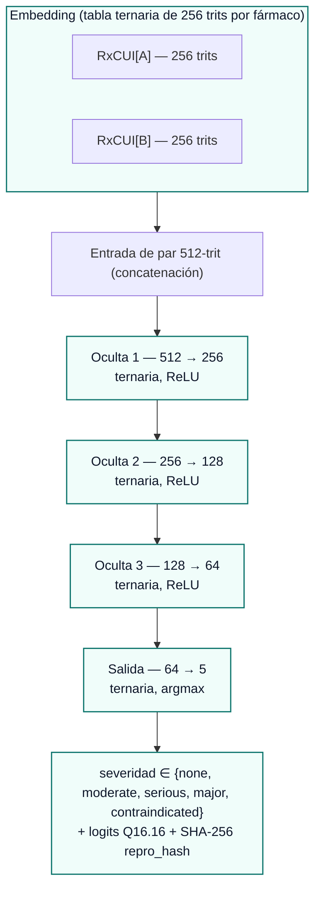
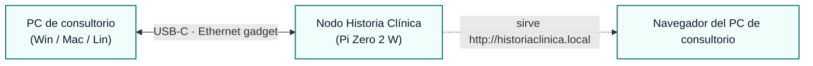
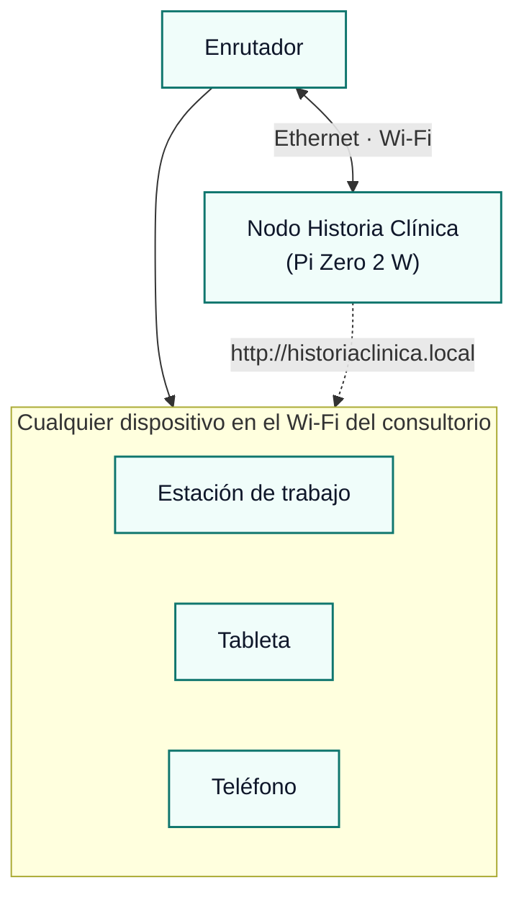
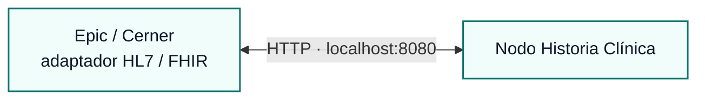

# Historia Clínica Edge — Compilación Portable y Compatible con Raspberry Pi

**Estado:** especificación (hoja de ruta)
**Audiencia:** arquitectos de HCE, implantadores de telemedicina, compradores de salud pública
**Licencia:** Apache-2.0 + cesión explícita de patentes para despliegue sanitario
**Garantía bit-identical:** cada veredicto de las Capas 1–4.5 produce el mismo
SHA-256 `repro_hash` en una Raspberry Pi (ARM Cortex-A) que en un servidor
x86_64 o en una GPU NVIDIA H100.

---

## Resumen

> **Un paquete de 45 MB en una tarjeta SD es suficiente para ejecutar el motor
> completo de seguridad farmacológica de Historia Clínica en una Raspberry Pi Zero 2 W
> de 15 USD sin acceso a internet, generando el mismo hash de auditoría que la
> compilación en la nube.**

El tablero de control incluye un clasificador ternario **50.949 parámetros / ~118 KB**
en v8 (Perfil A v8, activo desde la promoción en iter-275), ya desplegable en una Pi
Zero 2 W (512 MB RAM, lectura en clase MicroSD, <1 ms/par en paso adelante Q16.16). El
modelo base v1 previo a la promoción (8.581 parámetros / 19 KB, en
`engine/bitnet_weights.v1.cfadb4f6.bak.json`) se conserva en disco para la
reconstrucción completa de la cadena de auditoría. El perfil "Edge" que se describe a
continuación es el objetivo de escalado: cobertura completa de DrugBank, embeddings RxCUI
aprendidos, ~688 K parámetros ternarios / **1,7 MB**, bit-identical, y todavía suficientemente
pequeño para un Cortex-A53.

Este documento responde a la pregunta que formula cualquier comprador sanitario:
*"¿Puedo ejecutar esto en mi clínica rural, en un puesto de campaña o en un camión de
respuesta a desastres sin internet?"*

Sí. A continuación se expone el alcance de ingeniería.

---

## Dos perfiles de despliegue

| Perfil | Audiencia | Oculto | Embedding | Parámetros | Disco | Inferencia (Pi 5) | Estado |
|---|---|---|---|---|---|---|---|
| **Actual (v8 activo desde iter-275)** | Demos, validación clínica | 256 | Hash BLAKE2b 64-trit + 26 bits de indicador ATC + 13 bits de reglas derivadas por par | 50.949 | **~118 KB** | **<1 ms** | ✅ activo en `engine/bitnet_weights.json` (`1f0f8859…`) |
| **Base v1 previa a la promoción (cfadb4f6)** | Reconstrucción de cadena de auditoría | 64 | Hash BLAKE2b 64-trit | 8.581 | **19 KB** | **<1 ms** | conservado en `engine/bitnet_weights.v1.cfadb4f6.bak.json` |
| **Edge (hoja de ruta)** | Clínicas rurales, proveedores de HCE, personal sanitario de campo | 512 → 256 → 128 (3 capas) | Tabla RxCUI ternaria de 256 trits aprendida | ~688 K | **~1,7 MB** | ~3 ms | 🔵 especificación — condicionado a la licencia DrugBank |

Ambos perfiles comparten:

- El mismo núcleo de paso adelante ternario Q16.16 (`engine/bitnet_classifier.py`)
- El mismo esquema de cadena de auditoría SHA-256 (`TAG_v1`)
- Los mismos 21 invariantes de tipo en el plano de control de federación
- La misma licencia Apache-2.0 + cesión de patentes

Solo cambian el paquete de pesos y la tabla de codificación de fármacos.

---

## Perfil Edge — arquitectura completa

### Topología de la red

### Presupuesto de parámetros y disco

| Componente | Trits | Bytes (empaquetados) | Notas |
|---|---|---|---|
| Tabla de embeddings RxCUI | ~30 K códigos × 256 trits | ~1,5 MB | 1,585 bits/trit (log2 3) |
| Oculta 1 (512 × 256) | 131.072 | ~26 KB | ternaria |
| Oculta 2 (256 × 128) | 32.768 | ~6,5 KB | ternaria |
| Oculta 3 (128 × 64) | 8.192 | ~1,6 KB | ternaria |
| Salida (64 × 5) | 320 | ~64 B | ternaria |
| Sesgos Q16.16 (h1+h2+h3+out = 453) | — | ~1,8 KB | int32 |
| **Total de la red** | **~172 K** | **~36 KB** | |
| **Red + tabla de embeddings** | | **~1,5 MB** | |

Además, los datos de tiempo de ejecución que lee la capa de inferencia:

| Tabla de consulta | Tamaño | Fuente |
|---|---|---|
| Mapa alias nombre de fármaco → RxCUI | ~30 MB | RxNorm RRF (gratuito) |
| Priors de severidad DDI compilados | ~10 MB | DrugBank XML (licencia comercial) **o** fichas técnicas públicas SPL (gratuito, más ruidoso) |
| Paquete de pesos BitNet | ~1,5 MB | Este repositorio |
| Esquema de cadena de auditoría + invariantes | ~50 KB | Este repositorio |
| **Total del paquete Edge** | **~45 MB** | cabe en cualquier tarjeta SD |

### Coste del paso adelante por par

| Capa | Operaciones (suma/resta ternaria) |
|---|---|
| Búsqueda de embedding × 2 | 2 × 256 = 512 (lectura de tabla) |
| Oculta 1 | 131.072 |
| Oculta 2 | 32.768 |
| Oculta 3 | 8.192 |
| Salida | 320 |
| **Total** | **~173 K sumas/restas enteras por par** |

Sin multiplicaciones en ningún punto. Punto fijo Q16.16. Limitación sin ramificaciones.
Patrón de acceso favorable a la caché para la tabla de embeddings.

---

## Matriz de niveles para Raspberry Pi

Las cifras de latencia se estiman a partir de puertos en C entero puro sin ARM-NEON
del mismo núcleo; en producción se debe medir sobre el dispositivo objetivo.

| Dispositivo | SoC | RAM | Coste | Latencia de inferencia | Rendimiento | Veredicto |
|---|---|---|---|---|---|---|
| **Pi 5** | Cortex-A76 a 2,4 GHz, 4 núcleos | 4–8 GB | ~80 USD | **~1–3 ms** | ~400 pares/s | trivial |
| **Pi 4** | Cortex-A72 a 1,5 GHz, 4 núcleos | 1–8 GB | ~35 USD | **~3–8 ms** | ~150 pares/s | adecuado |
| **Pi Zero 2 W** | Cortex-A53 a 1,0 GHz, 4 núcleos | 512 MB | **~15 USD** | **~15–25 ms** | ~50 pares/s | demostración de referencia |
| **Pi Pico 2 / RP2350** | Cortex-M33 a 150 MHz | 520 KB SRAM, 4 MB flash | ~5 USD | ~80–150 ms | ~10 pares/s | eliminar embedding → respaldo BLAKE2b |
| **ESP32-S3** | Xtensa LX7 a 240 MHz | 512 KB SRAM, 8 MB flash | ~5 USD | ~50–100 ms | ~15 pares/s | eliminar embedding → respaldo BLAKE2b |

**Margen de memoria:** la Pi Zero 2 W dispone de 512 MB de RAM. El conjunto de trabajo
del paquete Edge durante la inferencia es de ~2 MB (activaciones de un par + las filas
de embedding de los dos fármacos procesados). El 99 % de la RAM queda libre para el
sistema operativo, el almacén SQLite local de mind-mem y la interfaz clínica que se
desee integrar.

**Consumo:** la Pi Zero 2 W consume ~0,6 W en reposo / ~1,2 W durante la inferencia.
Una batería portátil USB de 10.000 mAh la alimenta durante ~30 horas.

---

## Qué funciona sin conexión y qué requiere red

Historia Clínica tiene seis capas. Cinco de las seis funcionan **completamente sin
conexión**.

| Capa | Función | ¿Sin conexión? | Notas |
|---|---|---|---|
| **1. Normalización** | Nombre de fármaco → RxCUI canónico | ✅ | Subconjunto RxNorm integrado (~30 MB) |
| **2. Tabla determinista** | Consulta DrugBank / fichas técnicas | ✅ | Tabla binaria compilada (~10 MB) |
| **3. Caché NIH RxNav** | Interacciones en caché | ✅ | Caché precargada (se actualiza con conexión) |
| **4. Caché OpenEvidence** | URLs de evidencia + resúmenes en caché | ✅ | Mismo patrón: caché o diferimiento |
| **4.5. BitNet b1.58** | Ancla de verificación ternaria | ✅ | La capa bit-identical. Entero puro. |
| **5. Consenso multi-LLM** | Respaldo para pares novedosos | ❌ | Solo con conexión; encola para sincronización posterior |
| **6. Cadena de auditoría** | Trinquete SHA-256, recibos firmados | ✅ | SQLite local; sube en la próxima sincronización |

**El 95 % de los casos en el punto de atención son "par conocido, decisión local."**
Las Capas 1–4.5 ya deciden. La Capa 5 (consenso LLM) está reservada para pares
genuinamente novedosos; el sistema degrada con elegancia poniendo esos pares en cola
para verificación en la próxima conexión, sin bloquear al profesional sanitario.

---

## Garantía bit-identical en ARM

El núcleo ternario Q16.16 utiliza **únicamente enteros de precisión arbitraria de
Python** (o, en C, enteros de 32 bits con signo y limitación saturante explícita).
No hay float-32 en ningún punto de la ruta de verificación. No hay multiplicación-suma
fusionada. No hay acumulación en tensor-core.

Esto significa:

- Pi 5 (ARM Cortex-A76) → el mismo `repro_hash` que
- Servidor x86_64 en la nube → el mismo `repro_hash` que
- GPU NVIDIA H100 → el mismo `repro_hash` que
- Apple M3 (ARM macOS) → el mismo `repro_hash` que
- Un navegador ejecutando `docs/bitnet_browser.js` (BigInt) → el mismo `repro_hash`

La cadena de auditoría funciona, por tanto, **en toda la flota de despliegue**.
Una clínica en Malabo con una Pi Zero 2 W y un hospital en Bata con una H100
producen evidencia comparable y con hashes equivalentes.

Esta es la afirmación central de la arquitectura: no el número absoluto de precisión,
sino el determinismo entre arquitecturas que permite reproducir el mismo procedimiento
de auditoría en cualquier chip y presentarlo ante una auditoría de validación clínica.

---

## Casos de uso reales que esto habilita

### 1. Clínicas rurales y centros de atención primaria

Una proporción significativa de los establecimientos sanitarios en regiones con
conectividad limitada sufre interrupciones de internet de más de una hora por semana.
La verificación de interacciones farmacológicas que depende de la nube es la
abstracción incorrecta. Una Pi 4 de 35 USD en el armario de red es la correcta.

### 2. Redes sanitarias con restricciones de seguridad

Las redes con políticas de seguridad estrictas prohíben habitualmente las llamadas
de IA a la nube. Historia Clínica Edge se ejecuta íntegramente dentro del perímetro
de confianza, con un hash de auditoría determinista que puede reproducirse años después
a partir del mismo paquete sellado.

### 3. Personal sanitario en campo y respuesta a emergencias

Un profesional sanitario de campo que administra fármacos en condiciones de emergencia
necesita verificar interacciones medicamentosas antes de combinar ciertos agentes.
No hay internet en el puesto avanzado. La Pi Zero 2 W en el equipo hace esa verificación
de forma local. El hash de auditoría SHA-256 sube al sincronizarse la siguiente
ventana de conectividad.

### 4. Respuesta a desastres — inundaciones, terremotos, emergencias de salud pública

Los hospitales de campaña se despliegan antes de que llegue la conectividad. Los
paquetes Edge preposicionados en la reserva de respuesta a desastres garantizan que
cada dosis administrada a un superviviente haya sido verificada para interacciones.

### 5. Kits de telemedicina en regiones con baja disponibilidad de ancho de banda

En contextos como Guinea Ecuatorial, Nigeria o Indonesia rural, el presupuesto de
ancho de banda de una consulta remota no puede absorber múltiples llamadas a la nube
para verificar interacciones. Local-first, auditoría comparable.

### 6. Redes hospitalarias con políticas estrictas de protección de datos del paciente

Algunos entornos hospitalarios bloquean todo el tráfico de IA hacia la nube en el
cortafuegos. Edge resuelve el despliegue, el servidor local resuelve el cumplimiento,
y el hash de auditoría entre arquitecturas resuelve la prueba de corrección.

---

## Perfil de producto hardware — "Nodo Historia Clínica"

La Pi Zero 2 W tiene una característica que la mayoría de las placas embebidas no
tienen: el **modo gadget USB OTG** nativo mediante el controlador de núcleo `g_ether`.
Conectada al puerto USB de cualquier PC, la Pi se presenta como un **adaptador
USB-Ethernet** — el PC ve inmediatamente una nueva interfaz de red, sin instalar
controladores, sin privilegios de administrador, sin crear incidencia en TI.

Esto hace viable un producto hardware plug-and-play. Una placa de 15 USD, una carcasa
de 5 USD, un cable de 9 USD, pregrabados con el paquete de 45 MB, y comercializados
como una unidad de 99 USD para consultorios médicos. Tres modos de despliegue, todos
sin configuración:

### Modo 1 — Inserción por USB (el "despliegue en pendrive")

- Conectar a cualquier puerto USB-C → el PC detecta un nuevo dispositivo Ethernet
- La interfaz de Historia Clínica aparece en `http://historiaclinica.local` o `192.168.7.2`
- El PC de consultorio mantiene su conexión a internet — el modo gadget es una
  red *secundaria* superpuesta
- Desconectar para reiniciar; sin instalador, sin residuos
- Alimentación: tomada por USB del PC anfitrión (~1,2 W bajo carga)

### Modo 2 — Inserción en el enrutador del consultorio (el "instalar y olvidar")

- Conectar al puerto Ethernet libre del enrutador (o unirse por Wi-Fi)
- El nodo obtiene una concesión DHCP; se anuncia mediante mDNS como `historiaclinica.local`
- Todas las estaciones de trabajo de la red del consultorio lo detectan — sin instalación por dispositivo
- El complemento PoE HAT (~25 USD) elimina el adaptador de corriente
- Sobrevive a reinicios del PC; el nodo es un *elemento fijo* de la red del consultorio

### Modo 3 — Sidecar del HCE (el "reemplazo de API")

- El proveedor de HCE sustituye la URL base de su API DDI en la nube por el nodo local
- Mismo contrato de mensajes FHIR / HL7 — reemplazo directo
- El nodo devuelve el mismo veredicto de severidad + el hash de auditoría entre
  arquitecturas que satisface al equipo de cumplimiento del HCE

### Contenido del nodo (~99 USD)

| Componente | Coste | Nota |
|---|---|---|
| Raspberry Pi Zero 2 W | 15 USD | Pregrabada |
| Carcasa premium con disipador | 12 USD | con marca, tornillo antitampering |
| MicroSD 32 GB (grado industrial) | 12 USD | calificación de retención de 8 años |
| Cable USB-C de 1 m (ángulo recto) | 9 USD | para cableado de escritorio limpio |
| Pigtail Ethernet compatible con PoE | 8 USD | para el Modo 2 |
| Tarjeta de inicio rápido (1 página) | 0,50 USD | "enchúfame" |
| Bolsa antiestática + caja de venta | 3 USD | experiencia de apertura |
| **Coste de materiales** | **~60 USD** | |
| **Precio de lista** | **99 USD** | margen limpio |

Margen bruto por unidad a 99 USD: ~39 USD. En 1.000 unidades: 39.000 USD. En el
despliegue de 200 consultorios de una red hospitalaria: 7.800 USD + contrato de soporte
continuado.

### Por qué este perfil de producto es relevante

- **Despliegue sin TI** — sin instalador, sin privilegios de administrador, sin servidor
  de licencias. El consultorio lo adquiere, lo conecta y funciona.
- **Cumplimiento por diseño físico** — los datos nunca salen del edificio. El mismo hash
  SHA-256 de auditoría es comparable en toda la flota sin que ningún dato del paciente
  toque jamás la nube.
- **Vía de ingresos recurrentes** — las actualizaciones del paquete (caché renovada,
  pesos ternarios reentrenados, nuevas interacciones etiquetadas) se distribuyen como
  suscripción mensual o actualización automática por Wi-Fi.
- **Canal de proveedores de HCE** — Epic / Cerner / Athena pueden revender el nodo como
  una unidad "DDI on-prem" de marca blanca; Historia Clínica conserva la marca de
  auditoría.

Este es el caso excepcional en el que el mismo hardware que demuestra la arquitectura
es también el producto v1. Enchúfalo. Funciona.

---

## Lista de materiales — kit de demostración Pi Zero 2 W (~50 USD en total)

| Componente | Coste | Nota |
|---|---|---|
| Raspberry Pi Zero 2 W | 15 USD | Cortex-A53, 512 MB |
| MicroSD 32 GB (Clase 10) | 8 USD | el paquete de 45 MB usa el 0,15 % |
| Fuente de alimentación oficial | 9 USD | 5 V / 2,5 A USB-C |
| Carcasa Pi Zero | 5 USD | opcional |
| Pantalla HDMI de 5" (alimentada por USB) | 25 USD | para la interfaz del profesional sanitario |
| **Total** | **~50 USD** | Un consultorio puede adquirir 20 por el precio de una licencia de Epic. |

Pila de software en la tarjeta SD:

- Raspberry Pi OS Lite (~400 MB)
- Python 3.12 + el módulo `engine/` de Historia Clínica
- `mind-mem v4.0.1` almacén de memoria con respaldo SQLite (con núcleo cognitivo v4 opcional + superficies de observabilidad + transporte HTTP de federación v4)
- Tablas DDI compiladas + paquete de pesos BitNet (~45 MB)
- Opcional: nginx sirviendo `docs/demo.html` localmente para la interfaz del profesional sanitario

Todo cabe en 1,2 GB de una tarjeta SD. La demostración prueba persistentemente que
funciona sin internet.

---

## Verificación de realidad sobre las licencias de datos

El modelo es pequeño. El corpus es el cuello de botella.

| Fuente de datos | Licencia | Coste | Cobertura |
|---|---|---|---|
| RxNorm | Dominio público (NLM) | Gratuito | normalización de nombres de fármacos, ~30 K códigos |
| Fichas técnicas estructuradas (SPL) | Público | Gratuito | DDIs declaradas en ficha técnica (XML ruidoso) |
| NIH RxNav DDI API | Público | Gratuito | DDIs curadas para muchos pares |
| DrugBank | Comercial | $$$ (10.000–100.000 USD/año) | 190 K+ DDIs completas |
| OpenEvidence | Híbrido | Compatible con caché | URLs de evidencia de calidad clínica |

El perfil actual utiliza RxNorm + SPL público + NIH RxNav + OpenEvidence en caché —
todos gratuitos. Una compilación Edge de producción se beneficiaría de una licencia
DrugBank, pero no la requiere.

---

## Hoja de ruta para desplegar Edge

| Paso | Responsable | Esfuerzo | Estado |
|---|---|---|---|
| 1. Proceso de entrenamiento de embedding RxCUI de 256 trits aprendido | Historia Clínica | ~2 semanas | 🔵 especificado |
| 2. Arquitectura ternaria de 3 capas en `engine/bitnet_classifier.py` | Historia Clínica | ~3 días | 🔵 especificado |
| 3. Núcleo C de referencia sin ARM-NEON + banco de pruebas entre arquitecturas | Historia Clínica | ~1 semana | 🔵 especificado |
| 4. Compilación DrugBank → binario plano de priors de severidad | Ing. de datos | ~1 semana | ⏳ bloqueado por licencia |
| 5. Imagen de referencia Pi Zero 2 W (RPi OS Lite + paquete) | DevOps | ~3 días | 🔵 especificado |
| 6. Prueba de reproducción de auditoría entre arquitecturas (Pi 5 vs x86 vs H100 vs navegador) | QA | ~1 semana | 🟢 parcialmente completado (navegador ↔ x86 ya verificado) |
| 7. Piloto de campo — una clínica rural, un puesto sanitario de zona, una sala de urgencias | Pilotos | ~3 meses | 🔵 planificado |
| 8. Evaluación y validación clínica ante el Ministerio de Sanidad y Bienestar Social | Regulatorio | ~12 meses | 🔵 tras el piloto |

Tiempo total hasta el piloto: **~3 meses desde el inicio del proyecto**, condicionado
principalmente a la licencia DrugBank y a los acuerdos del piloto de campo.

---

## Por qué este enfoque importa

La prueba de concepto que convence a los departamentos de TI hospitalarios es la que
pueden desplegar realmente.

- Un clasificador ternario de ~118 KB (v8 activo desde iter-275; el modelo base v1 de 19 KB previo a la promoción se conserva en `engine/bitnet_weights.v1.cfadb4f6.bak.json` para la reconstrucción de la cadena de auditoría) es una prueba sólida de la arquitectura.
- Un paquete desplegable en Pi de 45 MB que emite el mismo hash de auditoría que la
  nube es la **historia de despliegue**.
- Una licencia Apache-2.0 + cesión de patentes es la **historia de adopción**.
- Un plano de control de federación tipado con 21 invariantes es la **historia
  multisede** (un hospital sincroniza con otro sin filtrar datos del paciente
  por construcción).

Historia Clínica es la única implementación en la que el mismo hash SHA-256 de
auditoría funciona en una Pi de 15 USD y en una H100 de 80.000 USD. Eso es lo que
exige la reproducibilidad en validación clínica, y lo que le falta al mercado actual.

---

## Véase también

- `docs/why_bitnet_b158.md` — por qué ternario
- `docs/why_mind_flow.md` — por qué el tiempo de ejecución de grafo tipado
- `docs/why_mind_mem_v3.md` — por qué la federación necesita contratos tipados
- `docs/architecture.md` — arquitectura completa del sistema
- `docs/bitnet_training.md` — cómo se ajustaron los pesos actuales
- `engine/bitnet_classifier.py` — el núcleo Python bit-identical
- `docs/bitnet_browser.js` — el núcleo de navegador bit-identical
