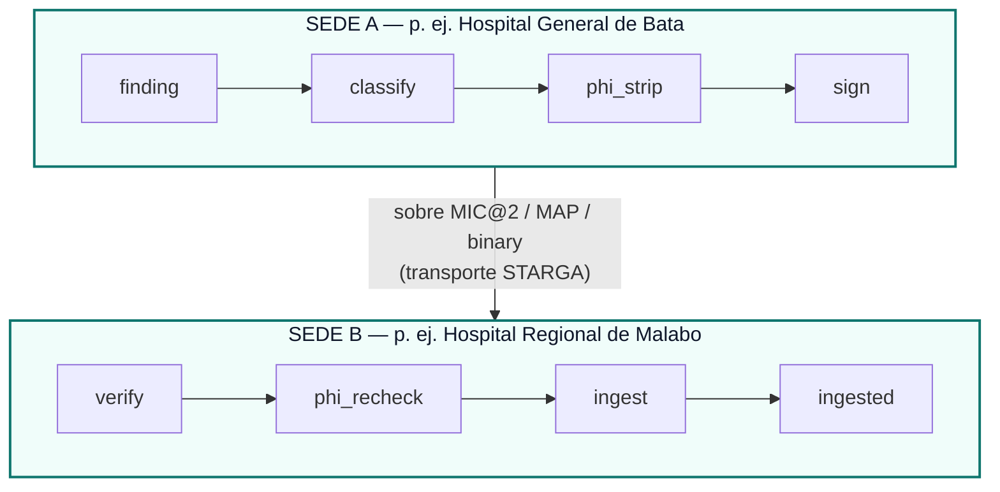

# Memoria Clínica Conjunta Federada

> *"Los datos del paciente nunca salen del edificio. El conocimiento sí."*

Historia Clínica es el primer sistema de memoria clínica diseñado para
federar hallazgos de interacciones farmacológicas, activaciones BitNet y
patrones de desacuerdo entre profesionales a través de múltiples sedes —
**sin mover jamás un solo identificador de paciente**. La frontera entre
datos del paciente y datos no identificables es un invariante tipado en
tiempo de ejecución en
[`flows/JointMemoryFederation.flow.mind`](../flows/JointMemoryFederation.flow.mind),
no un documento de política, no una lista de comprobación, no la promesa de
un proveedor.

## Por qué importa la federación en la IA sanitaria

Un hallazgo de seguridad descubierto en el Hospital General de Bata —
"warfarina + ibuprofeno con INR > 3,5 tiene un riesgo de lesión renal
aguda no reportado previamente en pacientes con ERC-3b" — no debería
re-descubrirse, dolorosamente, en cada otro hospital que ejecute Historia
Clínica. Lo mismo aplica a las activaciones novedosas del clasificador
BitNet en pares de fármacos raros, los patrones anonimizados de desacuerdo
entre profesionales de cardiología vs. nefrología, y los testigos de la
cadena de auditoría de una sede que quieren verificarse de forma cruzada
en otra.

Pero la restricción de protección de datos del paciente del sector
sanitario es innegociable: **los datos del paciente no pueden cruzar las
fronteras entre sedes** sin acuerdos explícitos de tratamiento de datos,
consentimiento del paciente o desidentificación a estándares de puerto
seguro.

La respuesta habitual del sector — "no federamos, re-descubriremos en cada
silo" — deja la seguridad de la IA clínica como un problema por sede e
imposibilita el efecto de red. Historia Clínica resuelve esto con una
**separación tipada de dos canales** incorporada en el contrato del flujo.

## Los dos canales

| Canal | Qué circula | A dónde va |
|---|---|---|
| **Canal de conocimiento** | Veredictos de gravedad de pares de fármacos (con `repro_hash` + `bundle_id`), salidas del clasificador BitNet en pares novedosos, testigos de la cadena de auditoría (solo recibos de hash), patrones anonimizados de desacuerdo entre profesionales (p. ej. "27% de cardiólogos apuntaron a <130/80 en ERC-3b + FA"), evidencia desidentificada de ejecución de flujos | A través de la federación, entre sedes, libre de propagarse |
| **Canal de datos del paciente** | Nombres de pacientes, fecha de nacimiento, número de historia, direcciones, identificadores de seguro, recursos FHIR Patient, notas clínicas de texto libre, notas MedicationStatement que referencian al paciente, valores Observation cuando se emparejan con contexto del paciente | **Permanece dentro de la sede de origen**, cifrado en reposo, acuerdo de tratamiento de datos requerido para cualquier acceso |

El clasificador en `flows/JointMemoryFederation.flow.mind::classify` es la
frontera estructural entre datos del paciente y datos no identificables. Su
salida (`lane`) es comprobada por un invariante tipado antes de que
cualquier dato llegue al transporte de federación:

```mind
node classify = @native federation_classify(finding)
invariant classify.lane in ["clinical_knowledge", "phi_lane"]
invariant classify.lane != "phi_lane" or scrubbed.empty == true
```

Una clasificación errónea no falla en abierto — falla en cerrado con un
`InvariantViolation` estructurado. El transporte nunca ve la carga útil.

## Transporte: protocolos STARGA con patente en trámite

La federación viaja sobre la próxima capa de red multimáquina de
`mind-mem`:

| Protocolo | Rol | Estado de PI |
|---|---|---|
| **MAP** (Mind Annotation Protocol) | Sobre de anotación tipado | **Patente en trámite — STARGA, Inc.** |
| **MIC@2** (Mind Interchange Coding v2) | Codificador/decodificador de formato de cable | **Patente en trámite — STARGA, Inc.** |
| **binary framing** | Enmarcado en el cable | **Patente en trámite — STARGA, Inc.** |

`mind-mem` en sí se publica bajo **Apache-2.0** en PyPI. La Sección 3 de la
licencia Apache incluye una concesión de patente explícita: cualquier
despliegue de Historia Clínica obtiene automáticamente el derecho de usar
los protocolos MIC@2 / MAP / binary con patente en trámite de STARGA **con
el fin de ejecutar mind-mem tal como se entrega**. Este es el alcance
correcto:

- Los hospitales pueden desplegar y federar libremente bajo Apache-2.0
- El uso independiente de MIC/MAP en productos no relacionados requiere una
  licencia separada de STARGA
- La cláusula de represalia de Apache-2.0 (§ 3 frase final) protege a
  mind-mem de bifurcaciones de ataque por patente

## Flujo de extremo a extremo



Cada paso en ambas direcciones está impuesto por un invariante tipado en
el contrato `.flow.mind`. El `plan_hash` direccionado por contenido del
contrato (SHA-256, actualmente `d96173f3...31d2`) se registra en la cadena
de auditoría para cada evento de federación; un auditor puede reproducir
cualquier intercambio pasado entre sedes contra el contrato fuente de forma
idéntica bit a bit.

## Defensa en profundidad

Tras tres rondas de endurecimiento (revisión de seguridad multiagente
2026-05-02, evaluación multi-LLM 10/10 y un pase de cifrado de carga útil),
**21 invariantes tipados en tiempo de ejecución** aplican en cada evento de
federación (desde 6 en v0.1):

**SALIDA (esta sede → pares):**

1. **Compuerta de clasificación de datos del paciente** — `classify.lane in ["clinical_knowledge", "phi_lane"]`; las cargas `phi_lane` se descartan antes de cualquier llamada de transporte.
2. **Depurador independiente de datos del paciente** — `phi_strip` ejecuta los 18 identificadores de puerto seguro sobre la carga útil; cualquier coincidencia bloquea la emisión.
3. **Guarda estructural FHIR** — incluso si el depurador omite un token, cualquier recurso `Patient`, `Observation`, `MedicationStatement`, `Encounter` o `DocumentReference` se pone en cuarentena solo por su forma. Defensa contra el fallo de modo común de `phi_strip` en ambos lados.
4. **`issued_at` + nonce de 128 bits** — cada registro emitido lleva una marca de tiempo Unix y un nonce fresco. Cierra la ventana de ataque por repetición.
5. **KeyEpoch en la firma** — las firmas Ed25519 incluyen la época de clave actual; la propagación de la lista de denegación revoca retroactivamente cada registro firmado bajo una época comprometida.
6. **Esquema de preimagen canónica** — TAG_v1 separado por NUL, punto fijo Q16.16. Fijado en el contrato para que el hash de la cadena de auditoría sea estable durante décadas.
7. **Idempotencia dividida** — `transport_dedup_hash` (sobre) es distinto de `semantic_idempotency_hash` (carga útil). La deduplicación es precisa incluso bajo reintentos con deriva de marca de tiempo.
8. **Cifrado de carga útil X25519 ECDH + ChaCha20-Poly1305** — incluso con los datos del paciente eliminados, la señal clínica desidentificada (veredictos de gravedad, activaciones BitNet, patrones de desacuerdo entre profesionales) es valiosa competitiva y adversarialmente. Nonce por registro + etiqueta AEAD verificada por el receptor antes de cualquier verificación de firma. Derivación de clave HKDF-SHA256. Cierra por completo la superficie de ataque de lectura en ruta.

**ENTRADA (pares → esta sede):**

9. **Descifrado X25519 + verificación de etiqueta AEAD** — falla en cerrado antes de la verificación de firma, de modo que un atacante no puede sondear las claves del remitente sin poseer la clave privada del receptor.
10. **Firma Ed25519 válida + KeyEpoch no revocada** — ambas comprobaciones pasan-o-cuarentena.
9. **Ventana de frescura** — los registros con más de 5 minutos de antigüedad (configurable) se rechazan. Protección contra repetición.
10. **Re-verificación de datos del paciente entrantes** — `phi_strip` se ejecuta de nuevo en el receptor antes de que el registro llegue al almacén local de mind-mem. Defensa en profundidad contra un par mal configurado.
11. **Comprobación de límites de nivel** — el `tier` suministrado por el par se acota a `[0..5]` contra el esquema de niveles local de mind-mem. Un par comprometido no puede forzar registros al bucket de retención más larga.
12. **Compuerta de quórum de gravedad** — para cualquier veredicto de gravedad de un par de fármacos, se acepta como **de grado de evidencia** SOLO si al menos **3-de-5** pares independientes han firmado registros concordantes (configurable). Los hallazgos de un solo par se almacenan en nivel bajo; los hallazgos confirmados por quórum se promueven. Previene clústeres de veredictos bimodales entre sedes — la corrección estructural para la reproducibilidad clínica a escala.
13. **Cadena de auditoría a prueba de manipulación** — cada intercambio entre sedes emite un recibo de hash TAG_v1; un auditor con la clave pública del originador puede re-verificar el intercambio décadas después.

El `plan_hash` direccionado por contenido del contrato es ahora
`6c6fb3ea…5846`. Un cambio en cualquier invariante cambia el hash, que la
cadena de auditoría registra para cada evento de federación — los
auditores detectan la deriva bit a bit.

## Qué NO está en el alcance

- Compartir datos de pacientes entre sedes — eso es un producto de red
  clínica (CommonWell, eHealth Exchange) y requiere acuerdo de tratamiento
  de datos explícito + consentimiento del paciente.
- Soporte de decisión clínica en tiempo real entre sedes basado en el
  contexto individual del paciente — eso es una arquitectura distinta
  (consulta federada vs. conocimiento federado).
- Aprendizaje federado del clasificador BitNet — podría ser una
  característica de v2 usando FedAvg o DP-SGD, pero el contrato v1 solo
  propaga paquetes de pesos entrenados y clasificaciones por par.

## Demostración en vivo (transporte simulado)

El transporte real MIC@2 / MAP / binary está en desarrollo activo. Hasta
que se entregue, cualquier revisor puede ejecutar la federación **de
extremo a extremo en un solo proceso** usando la demostración de transporte
simulado:

```bash
python3 scripts/federation_mock_demo.py
```

El script genera dos sedes de Historia Clínica en proceso (Hospital General
de Bata y Hospital Regional de Malabo), cada una con un par de claves
Ed25519 generado recientemente. La Sede A descubre warfarina + ibuprofeno
vía la tabla determinista de la Capa 1, lo ejecuta a través de la ruta
completa de salida (classify → phi_strip → stamp → sign → emit), y la Sede
B lo recibe sobre una cola Python en proceso, ejecutando la ruta completa
de entrada (verify → freshness_window → phi_recheck → tier_clamp → quorum →
ingest).

Salida esperada (abreviada):

```
══════════════════════════════════════════════════════════════════════
  Historia Clínica — Demostración Simulada de Federación de 2 Nodos
  JointMemoryFederation.flow.mind  ·  plan_hash: f2986d0736c3fd4c...
══════════════════════════════════════════════════════════════════════

  ✓ INVARIANTE 01 PASA  classify.lane in [clinical_knowledge, phi_lane]
  ✓ INVARIANTE 02 PASA  scrubbed.has_phi == false
  ...
  ✓ INVARIANTE 16 PASA  quorum.has_concurring_signatures or quorum.tier <= 1

  COINCIDENCIA DE CADENA DE AUDITORÍA — codificación canónica idéntica bit a bit
  Hash Sede A: 39788b9c83826ce39e8b69c9aa2586e3b7b550487ca0a37c8ef3bd505fc663b4
  Hash Sede B: 39788b9c83826ce39e8b69c9aa2586e3b7b550487ca0a37c8ef3bd505fc663b4

  Los 16 invariantes de JointMemoryFederation.flow.mind: PASAN
  DEMOSTRACIÓN DE FEDERACIÓN COMPLETA — salida 0
```

Los dos hashes de la cadena de auditoría coinciden porque la preimagen
canónica es TAG_v1 separada por NUL con campos ordenados
lexicográficamente — la codificación es determinista, así que ambas sedes
hashean los mismos bytes.

Para ejercitar la compuerta de datos del paciente (hallazgo puesto en
cuarentena antes del transporte):

```bash
python3 scripts/federation_mock_demo.py --phi-test
```

La demostración es un artefacto permanente de enseñanza y auditoría;
permanece ejecutable y significativa después de que se entregue el
transporte real.

## Estado

- `flows/JointMemoryFederation.flow.mind` — **entregado** (contrato
  tipado, **21 invariantes tipados** — todos los 21 ejercitados de extremo
  a extremo por la demostración simulada, con los invariantes de sellado
  X25519 10-14 ejercitados en proceso vía un ciclo de ida y vuelta
  `SealedEnvelope` + `_x25519_seal` / `_x25519_open` que refleja el
  transporte de cable HTTP de federación v4 publicado en mind-mem v4.0.1;
  plan_hash `cbfaf3e8…4e18b`)
- `scripts/federation_mock_demo.py` — **entregado** (prueba ejecutable de
  extremo a extremo del contrato; transporte simulado en proceso)
- transporte de cable HTTP de federación v4 de `mind-mem` — **entregado a
  mind-mem `main` 2026-05-11 (commit `16a3e25`)**: 4 nuevos endpoints en
  `src/mind_mem/http_transport.py` (`GET /federation/vclock/<block_id>`,
  `GET /federation/conflicts`, `POST /federation/write`,
  `POST /federation/resolve`) activados por bandera `v4.federation`, tope
  de cuerpo de 1 MiB, autenticación X-MindMem-Token (mismo contrato de
  fallo en cerrado que el transporte HTTP de un solo espacio de trabajo de
  v3.9.0); más el `mind_mem.v4.federation_client.FederationClient` de la
  biblioteca estándar con `get_vclock` / `list_conflicts` / `push_write` /
  `resolve_conflict` y clases de excepción específicas
  (`FederationAuthError`, `FederationFlagDisabled`,
  `FederationTransportError`). 11/11 pruebas de transporte de cable + 40/40
  pruebas existentes de `http_transport` pasan; ruff lint + format limpio.
  Publicado en mind-mem v4.0.1 en PyPI (2026-05-11) — Historia Clínica
  puede consumirlo en la próxima reconstrucción de Azure. mind-mem v4.0.0
  (publicado 2026-05-10) entregó las primitivas de **base** de federación
  v4 (`mind_mem.v4.federation`: block_tier_vclock + tier_conflict_log +
  enum MergeStrategy) más las suites de kernel-cognitivo +
  grafo-de-conocimiento + observabilidad + resiliencia — todas opcionales
  vía `mind-mem.json` `features.v4.<flag>`, sin cambios disruptivos a v3.x.
  Seguimientos del Grupo D aún diferidos: gRPC/QUIC, endurecimiento TLS,
  mTLS, OAuth/OIDC, DID/VC, puente ActivityPub.
- cableado del cliente de federación de Historia Clínica —
  `engine/federation_transport.py` consume el
  `mind_mem.v4.federation_client.FederationClient` de mind-mem v4.0.1 en la
  próxima reconstrucción de Azure; el puente
  `engine/federation_transport.py` está conformado para insertar
  `FederationClient` como la capa de cable bajo las llamadas existentes
  `record_publish_event` / `record_ingest_event`. El contrato anterior fija
  la superficie de API; el cambio es de una línea para la capa de cable,
  con cada capa superior (21 invariantes tipados, sobre criptográfico,
  registro de auditoría de la malla, flujo de fanout) permaneciendo
  idéntica bit a bit.

Este documento registra la arquitectura de federación de Historia Clínica;
para el estado de la capa de transporte de mind-mem, véase la documentación
de mind-mem aguas arriba.

---

*Apache-2.0 — STARGA, Inc.*
*MIC@2, MAP y binary framing son tecnologías STARGA con patente en trámite.*
